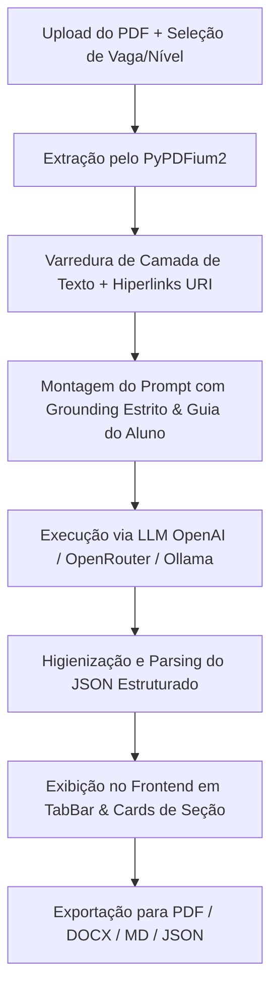

# Trivor — Motor de Análise e Diagnóstico de Currículos

> **Trivor** é um SaaS de inteligência artificial de alta precisão projetado para diagnosticar, auditar e otimizar currículos. Ele avalia o alinhamento com vagas de emprego, identifica gargalos que reprovam candidatos nos robôs ATS (Applicant Tracking Systems) e entrega recomendações altamente acionáveis baseadas nas melhores práticas do mercado de recrutamento.

---

## 📌 Sumário

1. [Visão Geral e Objetivo](#-visão-geral-e-objetivo)
2. [Por que as análises do Trivor NÃO são genéricas?](#-por-que-as-análises-do-trivor-não-são-genéricas)
3. [Principais Funcionalidades](#-principais-funcionalidades)
4. [Arquitetura e Tecnologias](#-arquitetura-e-tecnologias)
5. [Como Funciona o Diagnóstico (Etapa por Etapa)](#-como-funciona-o-diagnóstico-etapa-por-etapa)
6. [Instalação e Execução Local](#-instalação-e-execução-local)
7. [Formatos de Exportação](#-formatos-de-exportação)
8. [Licença](#-licença)

---

## 🎯 Visão Geral e Objetivo

Diferente de assistentes virtuais comuns ou chatbots que leem arquivos e emitem palpites superficiais, o **Trivor** foi construído como um **motor determinístico de auditoria**. 

O objetivo do Trivor é fechar a lacuna entre o candidato e as ferramentas de triagem automatizada (ATS) usadas por grandes empresas (como Gupy, Workday, Greenhouse, Lever e Taleo), garantindo que o currículo seja lido corretamente e se destaque perante recrutadores humanos.

---

## 🧠 Por que as análises do Trivor NÃO são genéricas?

O Trivor não faz elogios vagos nem "chuta" críticas. Todo o diagnóstico da inteligência artificial é governado por um **sistema de grounding estrito** e embasado em metrologias de recrutamento comprovadas:

### 1. 📐 A Fórmula XYZ do Google
O sistema audita a descrição de cada experiência buscando o padrão:
$$\text{Atingi } [X] \text{ (Resultado)}, \text{ mensurado por } [Y] \text{ (Métrica/Número)}, \text{ fazendo } [Z] \text{ (Ação/Tecnologia)}$$
Se as experiências forem puramente descritivas e sem impacto quantificável (%, R$, volume, tempo reduzido), a IA identifica a lacuna e ensina como reescrever.

### 2. 🎯 Adequação ao Nível de Senioridade (`job_level`)
A cobrança varia dinamicamente de acordo com o nível da vaga selecionado:
* **Estágio / Júnior**: Foco em projetos práticos, stack de tecnologias e clareza na formação.
* **Sênior / Especialista**: Exigência de métricas de liderança, impacto financeiro/negócio e educação ultrassintética (detalhes acadêmicos em excesso para seniores são apontados como poluição visual).

### 3. 🔍 Leitura Nível Byte de PDFs e Hiperlinks Ocultos
Utilizando o motor nativo `pypdfium2` (PDFium da Google), o Trivor varre não apenas o texto visível, mas também as **anotações de URI ocultas** (hiperlinks embutidos em botões ou palavras como "LinkedIn" e "GitHub"). Ele avalia se os links são funcionais para o recrutador ou se apenas o nome de usuário foi deixado sem link.

### 4. 🚫 Checklist de Eliminação Sumária (Erros Gravíssimos)
O motor detecta instantaneamente falhas que causam rejeição automática em robôs e recrutadores:
* **Barras de progresso / Porcentagens de habilidades** (ex: *"Python 80%"*).
* **Dados sensíveis desnecessários** (foto, CPF, RG, estado civil, endereço residencial completo).
* **Clichês vazios no resumo profissional** (ex: *"profissional apaixonado por tecnologia em busca de desafios"* sem apresentar stack ou conquistas).

---

## ⚡ Principais Funcionalidades

- **Resume Score (0 a 10)**: Nota geral ponderada com base no alinhamento do currículo.
- **Diagnóstico Estruturado por Seção**:
  - 👤 *Dados Pessoais & Contatos*
  - 📝 *Resumo / Perfil Profissional*
  - 💼 *Experiência Profissional & Métricas*
  - 🎓 *Formação Acadêmica & Cursos*
  - 🛠️ *Habilidades & Palavras-Chave*
- **Análise de Compatibilidade ATS**:
  - Score específico para leitores automatizados.
  - Tags de **Palavras-Chave Faltantes** no currículo.
  - Alertas de **Gargalos de Formatação/Parsing**.
  - **Veredito dos Robôs** em texto simples.
- **Suporte Multi-Provedor de IA**:
  - OpenAI (GPT-4o, GPT-4o-mini).
  - OpenRouter (Cloud Multi-models).
  - Ollama / Localhost (Llama3, Qwen, Mistral).
  - Endpoints HTTP/OpenAI compatíveis personalizados.
- **Persistência de Conexão (7 Dias)**: Teste de conectividade integrado com salvamento seguro das configurações no `localStorage`.
- **Métricas Transparentes de Tokens**: Exibição exata do consumo de tokens de Entrada (Prompt), Saída (Resposta) e Total.
- **Exportação Multiformato Profissional**: Download do diagnóstico em **PDF**, **DOCX**, **Markdown** e **JSON**.

---

## 🛠️ Arquitetura e Tecnologias

### **Frontend**
* **Framework**: [Next.js 16](https://nextjs.org/) (App Router, React 19).
* **Estilização**: [Tailwind CSS v4](https://tailwindcss.com/) com paleta *Dark Slate/Indigo Premium*.
* **Animações**: [Framer Motion](https://www.framer.com/motion/) com componentes interativos e microinterações.
* **Ícones**: [Lucide React](https://lucide.dev/).

### **Backend**
* **Framework**: [FastAPI](https://fastapi.tiangolo.com/) (Python 3.13).
* **Processamento de PDFs**: `pypdfium2` (Google PDFium Engine) com fallback para `docling`.
* **Motor de IA**: `openai` SDK com suporte a `base_url` customizada.
* **Geradores de Exportação**: `reportlab` (PDF profissional), `python-docx` (Word formatado).
* **Banco de Dados**: SQLite3 (armazenamento leve de análises).

---

## 🔄 Como Funciona o Diagnóstico (Etapa por Etapa)



---

## 🚀 Instalação e Execução Local

### Pré-requisitos
* **Node.js** (v18 ou superior)
* **Python** (v3.10 ou superior)

### 1. Clonar o Repositório
```bash
git clone https://github.com/seu-usuario/curriculo.git
cd curriculo
```

### 2. Configurar o Backend (FastAPI)
```bash
# Criar e ativar o ambiente virtual (Windows PowerShell)
python -m venv venv
.\venv\Scripts\Activate.ps1

# Instalar dependências
pip install -r backend/requirements.txt

# Iniciar o servidor backend
python -m uvicorn backend.main:app --host 127.0.0.1 --port 8000 --reload
```

### 3. Configurar o Frontend (Next.js)
Em outro terminal:
```bash
cd frontend

# Instalar dependências
npm install

# Iniciar o servidor frontend
npm run dev
```

Abra o navegador em `http://localhost:3000`.

---

## 📄 Formatos de Exportação

| Formato | Descrição |
|---|---|
| **PDF** | Documento visualmente elegante gerado via ReportLab com banners de score, selos de status e tabela de parecer. |
| **DOCX** | Arquivo do Microsoft Word formatado com tabelas estilizadas em tons Slate/Indigo para edição. |
| **Markdown (.md)** | Estrutura limpa em Markdown ideal para integração em documentações e Git. |
| **JSON (.json)** | Payload de dados brutos estruturados para consumo por APIs externas. |

---

<p align="center">
  Desenvolvido com 💜 e foco em alta precisão técnica.
</p>
